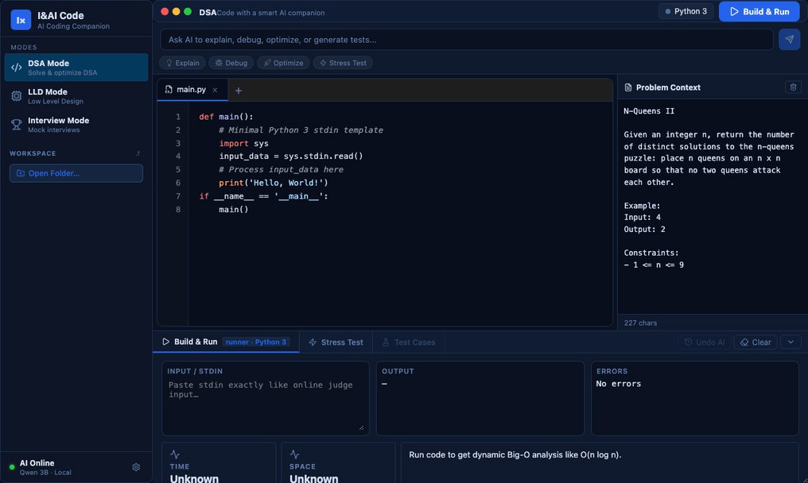
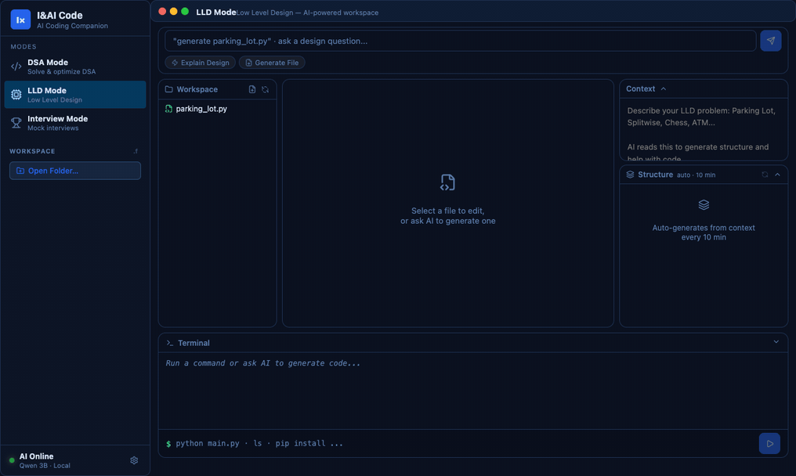
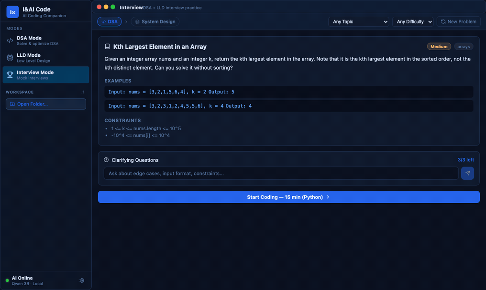

<div align="center">

# I&AI Code

**Your offline AI coding interview coach — DSA, LLD & mock interviews.**
**No API keys. No cloud. No subscription. Nothing leaves your machine.**

*Runs a Qwen2.5-Coder model entirely on your laptop via [llama.cpp](https://github.com/ggml-org/llama.cpp).*



</div>

---

## Why

Interview-prep AI tools want a subscription and send your code to someone's cloud. I&AI Code runs a 3B coding model locally — it works on a plane, costs nothing per token, and your code never leaves your machine.

| | |
|---|---|
| 🧩 **DSA Mode** | Write, run & debug — AI traces your logic to the exact buggy line, explains time/space complexity, one-click patches |
| 🏗 **LLD Mode** | Low-level-design workspace — AI generates class structures, writes & patches code files, built-in terminal |
| 🎤 **Interview Mode** | 20 DSA + 20 LLD mock problems, full test suites, a rubric-based AI judge, 45-min timer |
| 🌐 **Clear English replies** | Concise, casual, technically precise |
| 🎨 **Themes** | Dark & light, GitHub-style syntax highlighting |

## Quick Start

```bash
git clone https://github.com/rastogialankrit823-ai/I-AI-code.git
cd I-AI-code
./scripts/install.sh   # one-time: builds llama.cpp, downloads model (~2.3 GB), builds the desktop app
```

That's it — **once**. The installer ends with a real desktop app (`/Applications/I&AI Code.app` on macOS, AppImage/deb on Linux). From then on it behaves like any normal app:

- **Open it** from Spotlight/Dock → llama.cpp + backend start automatically (splash shows progress)
- **Quit it** → services stop cleanly
- **Reopen anytime** → no rebuild, no terminal, ever. If a previous run left services alive, the app reuses or replaces them automatically

Prefer no desktop app? Answer "n" during install and use `./scripts/start.sh` — it starts everything and opens an app-style browser window.

### System requirements

- **RAM:** 8 GB+ (model uses ~3 GB)
- **Disk:** ~4 GB (model + toolchain)
- **OS:** macOS 12+ (Apple Silicon = fastest, Metal GPU), Linux (CUDA auto-detected, CPU fallback), Windows via WSL2
- **Tools:** Python 3.10+, Node 18+, cmake, git — the installer checks and tells you exactly what's missing

## What it looks like

### DSA Mode
Paste a LeetCode problem, write your solution, hit Run. The AI compares your output against the expected answer, and when it's wrong, traces the code to find the *exact* line — including deep logic bugs like a missing backtrack in N-Queens.


### LLD Mode
Describe a design ("Design a parking lot") — the structure panel auto-generates a class diagram. Tell the AI *"generate parking_lot.py"* and it writes the complete file into your workspace; open it and say *"add thread safety"* to patch in place. Run it in the built-in terminal.



### Interview Mode
Timed mock interviews: DSA problems run against full test suites with pass/fail per case; LLD problems are scored question-by-question by a rubric-based judge that verifies its own claims against your answer before scoring.



## Architecture

```
┌─────────────────────┐     HTTP      ┌──────────────────────┐
│   React Frontend    │ ◄───────────► │   FastAPI Backend    │
│   Vite · port 5173  │               │   Python · port 8000 │
└─────────────────────┘               └──────────┬───────────┘
                                                 │ HTTP
                                      ┌──────────▼───────────┐
                                      │   llama.cpp server   │
                                      │  Qwen2.5-Coder GGUF  │
                                      │      port 8081       │
                                      └──────────────────────┘
```

- **Frontend** — React 18 + Vite, custom CSS, no UI framework
- **Backend** — FastAPI with async parallel task queues: code execution, LLM prompting, stress testing, workspace file ops
- **Model** — Qwen2.5-Coder-3B-Instruct (Q5_K_M GGUF) served by `llama-server` with an OpenAI-compatible API. Swap in any GGUF you like (see below)

### Making a 3B model a reliable judge

Small models fail at open-ended "score this 0–100" tasks. This project works around that with engineering rather than model size:

- **Deterministic first** — a static scanner catches classic bugs (e.g. missing backtrack/discard asymmetry) instantly, before any LLM call
- **Binary rubrics** — the LLD judge answers yes/no per reference point instead of producing a free-form score, and must **quote your answer** to claim a point is addressed; unverifiable claims are flipped to "no"
- **Clamped scoring** — the LLM's score can only move ±30 from a deterministically computed coverage baseline
- **Per-feature token budgets** — every prompt has a hard output cap tuned for CPU inference latency

## Configuration

Backend settings live in `backend/.env` (created from `.env.example` on install):

| Variable | Default | Description |
|----------|---------|-------------|
| `LLAMACPP_URL_MAIN` | `http://127.0.0.1:8081/v1/...` | LLM endpoint |
| `LLAMACPP_MAX_TOKENS` | `8192` | Max tokens per call |
| `LLM_TIMEOUT_SECONDS` | `120` | Per-request timeout |
| `RUNNER_MODE` | `auto` | `auto` · `local` · `docker` (sandboxed execution) |
| `TAVILY_API_KEY` | *(empty)* | Optional web-search augmentation |
| `LLD_WORKSPACE` | `./lld-workspace` | LLD mode file storage |

**Use a different model:** drop any instruct-tuned GGUF into `models/` (first `.gguf` found is used), or set `"model": "/path/to/model.gguf"` in `~/.iandai/config.json`. A 7B model gives noticeably better LLD reviews if you have 8+ GB free RAM.

## FAQ

**Does anything leave my machine?**
No. The only network calls are the one-time model download and (optionally, off by default unless you add a key) Tavily web search.

**Why is the AI slow on my machine?**
CPU inference of a 3B model takes 10–80 s for long answers. Apple Silicon with Metal is several times faster than Intel. Use a smaller quant (Q4) or the 1.5B model for speed.

**Port already in use?**
The stack uses 5173 (frontend), 8000 (backend), 8081 (llama). Stop conflicting services or edit the ports in `backend/.env`, `scripts/start.sh`.

**Can I use it without the desktop app build?**
Yes — `./scripts/start.sh` opens a standalone app-style window (no browser chrome) using Chrome/Edge/Brave, falling back to your default browser.

## Uninstall

```bash
./scripts/uninstall.sh           # remove the desktop app + config, stop all services
./scripts/uninstall.sh --purge   # also delete the model, llama.cpp build, venv, node_modules (~7 GB)
./scripts/uninstall.sh --dry-run # preview what would be removed
```

Source files are always kept — delete the cloned folder to remove everything.

## Roadmap

- [ ] Prebuilt signed installers (macOS `.dmg`, Linux AppImage, Windows)
- [ ] C++/Java support in DSA & Interview modes
- [ ] Model manager UI — download/switch models in-app
- [ ] More interview problem packs
- [ ] Session history & progress tracking

## Contributing

Issues and PRs welcome. Good first areas: new interview problems (`frontend/src/data/`), prompt improvements (`backend/ai_engine.py`), and Linux/WSL testing of `scripts/install.sh`.

## License

[MIT](LICENSE)
